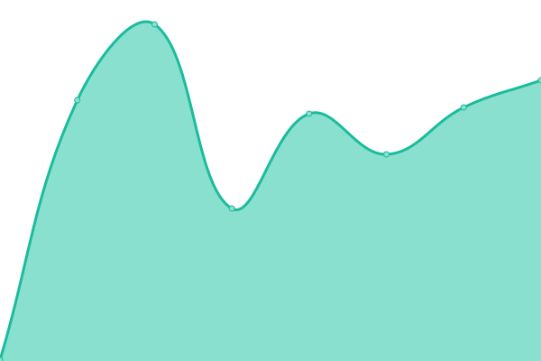

# [📈 Live Status](https://blavian.github.io/status_codes): <!--live status--> **🟧 Partial outage**

This repository contains the open-source uptime monitor and status page for [Benjamin Lavian](https://blavian.github.io/status_codes), powered by [Upptime](https://github.com/upptime/upptime).

With [Upptime](https://upptime.js.org), you can get your own unlimited and free uptime monitor and status page, powered entirely by a GitHub repository. We use [Issues](https://github.com/blavian/status_codes/issues) as incident reports, [Actions](https://github.com/blavian/status_codes/actions) as uptime monitors, and [Pages](https://blavian.github.io/status_codes) for the status page.

<!--start: status pages-->
<!-- This summary is generated by Upptime (https://github.com/upptime/upptime) -->
<!-- Do not edit this manually, your changes will be overwritten -->
<!-- prettier-ignore -->
| URL | Status | History | Response Time | Uptime |
| --- | ------ | ------- | ------------- | ------ |
|  [Auth](https://auth.mpulsemobile.com/) | 🟩 Up | [auth.yml](https://github.com/blavian/status_codes/commits/HEAD/history/auth.yml) | 

 257ms
     
 | 

<a href="https://blavian.github.io/status_codes/history/auth">100.00%</a>
    

|  [Auth stage](https://auth.stage.mpulsemobile.com/) | 🟩 Up | [auth-stage.yml](https://github.com/blavian/status_codes/commits/HEAD/history/auth-stage.yml) | 

 321ms
     
 | 

<a href="https://blavian.github.io/status_codes/history/auth-stage">100.00%</a>
    

|  [Link Shortener Stage](https://stage-shorten.mpulse.io/account/1131/shorten_url/) | 🟥 Down | [link-shortener-stage.yml](https://github.com/blavian/status_codes/commits/HEAD/history/link-shortener-stage.yml) | 

 0ms
     
 | 

<a href="https://blavian.github.io/status_codes/history/link-shortener-stage">0.00%</a>
    

<!--end: status pages-->

[**Visit our status website →**](https://blavian.github.io/status_codes)

## 📄 License

- Powered by: [Upptime](https://github.com/upptime/upptime)
- Code: [MIT](./LICENSE) © [Benjamin Lavian](https://blavian.github.io/status_codes)
- Data in the `./history` directory: [Open Database License](https://opendatacommons.org/licenses/odbl/1-0/)
